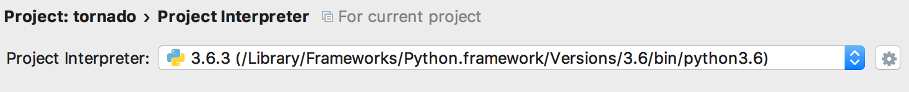
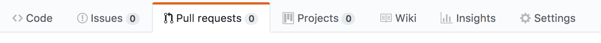
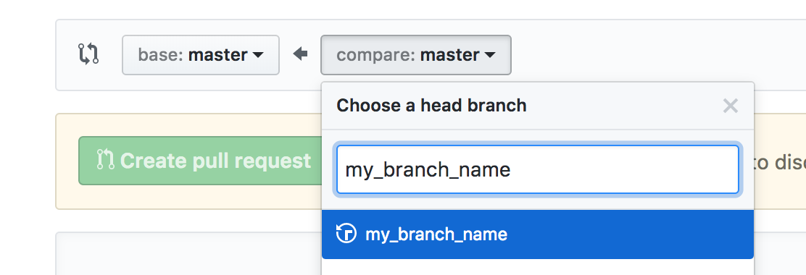
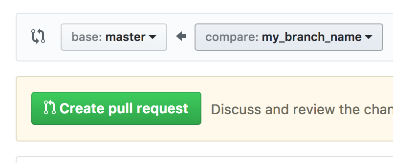

### Before starting
In this documentation, we will use the terminal to perform some command lines. Here, every command will be prefixed by __$__. 

### Prerequisites
1) Download git :
    Git is a tool to handle your code changes locally, add changes to the main remote project in collaboration with teammates.

- for Mac: http://sourceforge.net/projects/git-osx-installer/
- for Linux: $apt-get install git
    
Once installed, please check if it is on your computer with `$git --version` (your version number has to be display, if not git seems to be not installed) 
    
 If your are not familiar with git, please Read [this documentation](https://git-scm.com/docs/gittutorial) to understand basics.  
    
2) You need to have an ssh key on your machine, if you don't, follow [this link](https://help.github.com/articles/generating-a-new-ssh-key-and-adding-it-to-the-ssh-agent/#platform-linux) to create one.
3) Add your **public** ssh key to your github account (Top right avatar > Profile > Settings > SSH and GPG keys)

### Get the project!

In your favorite terminal (for Mac we advice you to get iTerm2, for linux the default terminal with [ohmyzsh](https://github.com/robbyrussell/oh-my-zsh))

(1) Go to home ~ folder (2) create a project directory and (3) retrieve data sources:

$`cd ~` (tilde means home)

$`mkdir arbreole && cd arbreole` (mkdir: make directory, cd: change directory)

$`git clone git@github.com:Tactyk/arbreole.git`

### Project architecture

You can see now the project structure in your 'arbreole' folder

$``ls`` (i.e. list the current folder)

### Development tools

- Download and install [PyCharm Community Edition](https://www.jetbrains.com/pycharm/download/) 

- Configuration:

    Preferences > Project > Project Interpreter >
    1) Click on the setting wheel and
    2) Choose a Python 3 interpreter
    

### RaspberryPi (rPi) initialization:

Please follow [this link](https://www.imore.com/how-get-started-using-raspberry-pi) to format SD card and install Raspbian (Debian version for rPi)

### RaspberryPi (rPi) connection:

1) Please make sure that your raspberryPi is connected to the same wifi as your computer sharing connection between both via ethernet cable.

Linux (Ubuntu): https://roughlea.wordpress.com/raspberry-pi-experiences/configure-the-raspberry-pi-to-share-a-linux-internet-connection/

Mac: https://medium.com/@tzhenghao/how-to-ssh-into-your-raspberry-pi-with-a-mac-and-ethernet-cable-636a197d055` 

2) Find RaspberryPi IP:

- into the raspberryPi (need to cable a monitor with an HDMI), open a terminal and type
    $ `ifconfig`
- copy the raspberryPi (en0) IP. Replace the IP in the arbreole/scripts/raspberry_hostnames (please keep the "pi@") 

- From your computer you can now connect to your raspberryPi via ssh.

$`ssh pi@{raspberry-ip}` {raspberry-ip} means it is a variable that you have to change with the raspberry IP (192.23.98.10 for example). It will ask you for a password, the default one is **raspberry**

### RaspberryPi (rPi) installation:

In this project, we use **python3**. In order order to install python3 packages, please use pip3 packages installer. It should be already in rPi but nevertheless:

- **In your rPi**, no matter where,
  
    - Update packages
    
        $`sudo apt-get update`

    - Install pip3 and python3
    
        $`sudo apt-get install python3-pip`
        
    - Install packages

        To communicate with the server, we will use websockets, we gonna use **websocket-client**, a well-proof library for websocket usage. 
        
        $`pip3 install websocket-client`  
    
        These packages will be installed in the /usr/local/lib/ folder ($`ls /usr/local/lib/` if you don't trust me ;) )  
        NB: If you want to list all python packages install for python3 please type $`pip3 list`
    
        Each module will be recognize by your IDE (PyCharm or other) because it knows the PYTHONPATH global environment var.
        If you needed to put modules in a special folder. You should add its path to PYTHONPATH var to avoid errors in your IDE:
        $`export PYTHONPATH="${PYTHONPATH}:/my/other/path"`    

- In **your machine** from **your project folder** (arbreole/):

    $`./scripts/install_raspberry_pi.sh` (it will ask you for password two times)

### Server installation:

In order to have a Python Webserver and an easy websocket usage, we gonna use python Tornado framework.  

**In your machine:**
- Prerequisites are same than for rPi session.

- Install tornado:

    $`pip3 install tornado`

### Usage

Everything is now installed !

  
### Run the local server

You can now run the local webserver typing in your project folder :
`python3 ./server/webserver.py`

You should see a `Server listening on port: 8080` message if everything is going well.

Go on `http://{host-ip}:8080/` to see the interface page.

A first client is now connected to the server via websocket.

NB: Open the developer console tool to see logs for debugging. (Right click > inspect > Console tab)

#### Run the rPi client server

1) SSH Connection to rPi

    $`ssh pi@{raspberry-ip}`
    
2) Go on project folder
    $`cd arbreole/src/`

3) Add your server IP
    
From your server host: $`ifconfig` > Copy your en0 IP
    
From arbreole/src/: $`nano webSocketClient.py` > Paste your IP in the ws//XX.XX.XX.XX/ws address
    
3) Run the client

$`python3 webSocketClient.py`
    
you should see `Server connection opened` in your rPi terminal side and `New connection` at the server host side termainal.
    
    
Everything is now connected by websocket. Try to add a text in your interface, enter and see every logs in terminal / console.

#### Client Config

You can find client config file into the raspberryPi/config/ folder, named config.ini. It is handled by the module configparser that can retrieve all nested config separated by sections.
See [configparser doc](https://docs.python.org/3/library/configparser.html) to use it.
  

#### Scripts

You can find some useful scripts into server/script/ folder. To run it, **from this folder**, please type ``./server/scripts/{script-name}.sh`` 

- update_config.sh : change your local config.ini 

### Contributing
If you want to add your code to the project please follow this simple rule to do a Pull Request.

If your are not familiar with git or gitflow, please read these little doc before:
- https://git-scm.com/book/fr/v1/Git-distribu%C3%A9-Contribution-%C3%A0-un-projet
- https://git-scm.com/book/fr/v1/Les-branches-avec-Git-Brancher-et-fusionner%C2%A0%3A-les-bases

**Start a new work**
 - Sync the current project with your local.
 
 $`git checkout master` (go to your local master branch)
 
 $`git pull` (retrieve master state on the remote branch)
 
 - Create your own branch.
 
 $`git checkout -b my_branch_name` (create a new branch based on master)
 
 **Work locally**
 
   - Change your files locally as you need
    
   - Tell git that your file as be added to your pull request
        $`git status` to the what files changed during your work  
        
        $`git add ../path/to/the/file` for all files that you want to save
  
 **Save your work**
     
    $`git commit -m "Your commit message"`
    
 **Push your work to the remote repository**
 
   $`git push origin my_branch_name`
       
**Create a pull request**

In order to fuse your work with the current project please go on https://github.com/Tactyk/arbreole/pulls or click on the  of the github project.

- Click on the pull request button  and choose master as a base branch and choose your branch to compare 
- Click on the create pull request button  
- Ask for a review on slack ! 

##TODO 
pip3 install tornado
pip3 install pyserial
pip3 install websocket-client

TroubleShootings
- Import not recognize
open one folder at once with PyCharm
