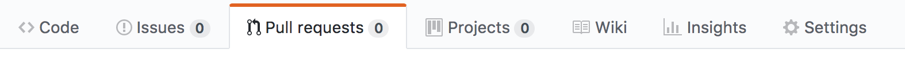

### Configuration

1. Download git :
   Git is a tool to handle your code changes locally, add changes to the main remote project in collaboration with teammates.

   * for Mac: http://sourceforge.net/projects/git-osx-installer/
   * for Linux: $apt-get install git

   Once installed, please check if it is on your computer with `$git --version` (your version number has to be display, if not git seems to be not installed)

   If your are not familiar with git, please Read [this documentation](https://git-scm.com/docs/gittutorial) to understand basics.

2. You need to have an ssh key on your machine, if you don't, follow [this link](https://help.github.com/articles/generating-a-new-ssh-key-and-adding-it-to-the-ssh-agent/#platform-linux) to create one.

3. Add your **public** ssh key to your github account (Top right avatar > Profile > Settings > SSH and GPG keys)

### Pull requests

If your are not familiar with git or gitflow, please read these little doc before:

* https://git-scm.com/book/fr/v1/Git-distribu%C3%A9-Contribution-%C3%A0-un-projet
* https://git-scm.com/book/fr/v1/Les-branches-avec-Git-Brancher-et-fusionner%C2%A0%3A-les-bases

**Start a new work**

* Sync the current project with your local.

$`git checkout master` (go to your local master branch)

$`git pull` (retrieve master state on the remote branch)

* Create your own branch.

$`git checkout -b my_branch_name` (create a new branch based on master)

**Work locally**

* Change your files locally as you need

* Tell git that your file as be added to your pull request
  $`git status` to the what files changed during your work
  $`git add ../path/to/the/file` for all files that you want to save

**Save your work**

$`git commit -m "Your commit message"`

**Push your work to the remote repository**

$`git push origin my_branch_name`

**Create a pull request**

In order to fuse your work with the current project please go on https://github.com/Tactyk/arbreole/pulls or click on the  of the github project.

* Click on the pull request button  and choose master as a base branch and choose your branch to compare 
* Click on the create pull request button 
* Ask for a review on slack !
